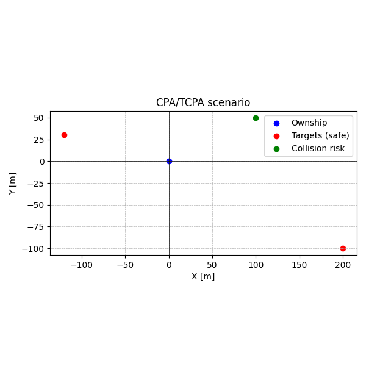

# CPA / TCPA Demo (Python + C++)

A small prototype of a collision-risk assessment module for vessels based on radar data.

## Implemented Features

**Common logic**

- Computes CPA (Closest Point of Approach) and TCPA (Time to CPA) for each target.
- Collision risk rule: `CPA < 50 m` and `0 <= TCPA < 30 s`.
- Classifies targets into *dangerous* and *safe*.

**Python (Variant A)**

- Reads targets from CSV: `id,x,y,speed,course`.
- Computes CPA/TCPA for each target.
- Prints text output to console in the format:
  `Target 1: CPA=42.3m, TCPA=12.5s COLLISION RISK`
- Visualizes the scene using `matplotlib`:
  - blue dot — own catamaran,
  - red dots — safe targets,
  - green dots — dangerous targets.

**C++ (Variant B)**

- Reads time series from CSV: `time,id,x,y,speed,course`.
- For each `id`:
  - Runs a 2D Kalman filter (state `[x, y, vx, vy]`) to smooth the trajectory.
  - Computes CPA/TCPA using the filtered state.
- Prints a result table in the console.
- ASCII “radar” (41×41):
  - `O` — own ship,
  - `X` — safe targets,
  - `C` — dangerous targets.
- CLI flags:
  - `--own-speed V` — own ship speed (m/s),
  - `--own-course DEG` — own ship course (degrees),
  - `--json-out file` — save results to JSON
    (trajectories, filtered states, CPA/TCPA).

---

## How to Run

### Python

Dependencies:

```bash
pip install matplotlib
```

Example CSV (`targets.csv`):

```csv
id,x,y,speed,course
1,100,50,5,180
2,-120,30,3,90
3,200,-100,8,210
```

Run:

```bash
python cpa_risk.py targets.csv
```

Example console output:

```text
Target 1: CPA=42.3m, TCPA=12.5s COLLISION RISK
Target 2: CPA=85.1m, TCPA=47.2s Safe
Target 3: CPA=65.7m, TCPA=33.0s Safe
```

A PNG file (e.g. `1.png`) with the visualization is also produced:
blue point = ownship, red = safe targets, green = collision risk.



---

### C++

Build with CMake:

```bash
mkdir build
cd build
cmake ..
cmake --build .
```

Example time-series CSV (`targets_timeseries.csv`):

```csv
time,id,x,y,speed,course
0,1,100,50,5,180
1,1,95,50,5,180
2,1,90,50,5,180

0,2,-120,30,3,90
1,2,-117,30,3,90
2,2,-114,30,3,90

0,3,200,-100,8,210
1,3,192,-104,8,210
2,3,184,-108,8,210
```

Run with default ownship parameters:

```bash
./cpa_risk ../data/targets_timeseries.csv
```

Example console output:

```text
=== CPA / TCPA Results (Kalman, final state per id) ===
ID      CPA [m]     TCPA [s]    Status
---------------------------------------
1       42.3        12.5        COLLISION RISK
2       85.1        47.2        Safe
3       65.7        33.0        Safe
```

ASCII radar:

```text
=== ASCII Radar View (filtered final positions) ===
Top = +Y, Right = +X
Approx. scale: 200.0 m ~ 20 cells

..............X...............................
.............................C................
.........................O....................
...

Legend: O = ownship, X = target, C = collision risk
```


Run with custom ownship parameters and JSON export:

```bash
./cpa_risk ../data/targets_timeseries.csv     --own-speed 15.0     --own-course 45.0     --json-out results.json
```

The `results.json` file contains raw trajectories, filtered states and CPA/TCPA for each target.
